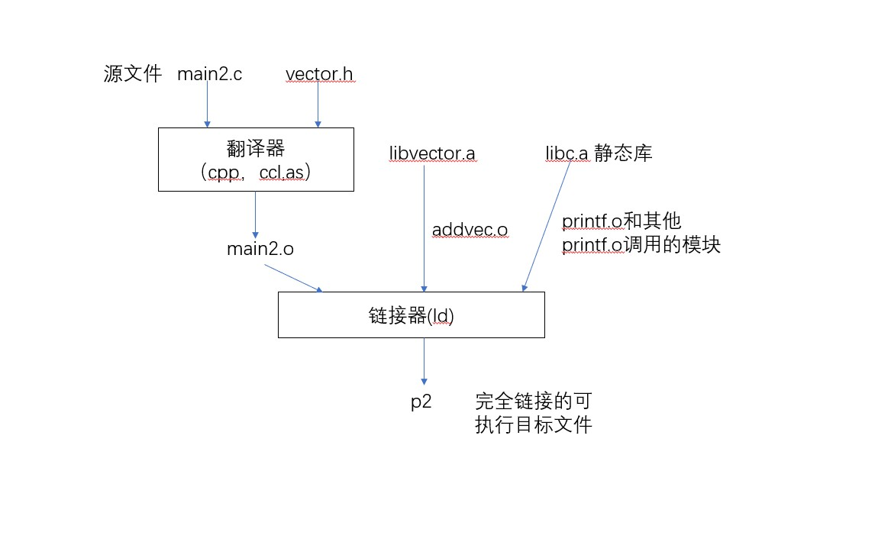

# slam十四讲笔记
## 李群李代数
旋转矩阵和变换矩阵，对加法是不封闭的。
## 单目相机的成像过程
1. 首先，世界坐标系下有一个固定的点P，世界坐标Pw
2. 由于相机在运动，它的运动由R,T或变换矩阵T描述，P的相机坐标为
    Pc = RPw + t
3. 这时的Pc仍有x,y,z三个量，把他们投影到归一化平面Z=1上，得到P的归一化相机坐标：Pc= [X/Z,Y/Z,1]T
4. 最后，P的归一化坐标经过内参后，对应到像素坐标:Puv = KPc

110
## 双目相机的成像过程

    

